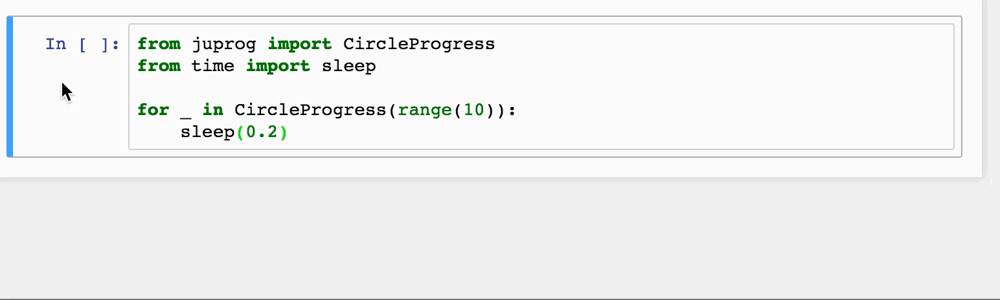

juprog
======
Circle progress for Jupyter notebook

Basic Example
=============

```python

from time import sleep
from juprog import CircleProgress

sequence = range(10)
for x in CircleProgress(sequence):
    # fake long process
    sleep(0.2)
```



Install
=======

Release
-------
```bash
    pip install juprog
```

Development version
-------------------

```bash
    pip install git+https://github.com/hainm/juprog
```

Acknowledgement
===============
Use [progress-circle](https://github.com/iammary/progress-circle) for displaying progress. 
